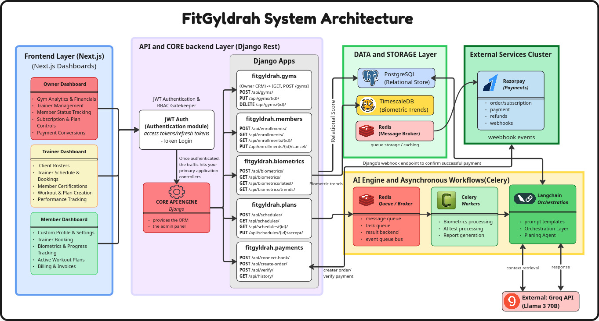
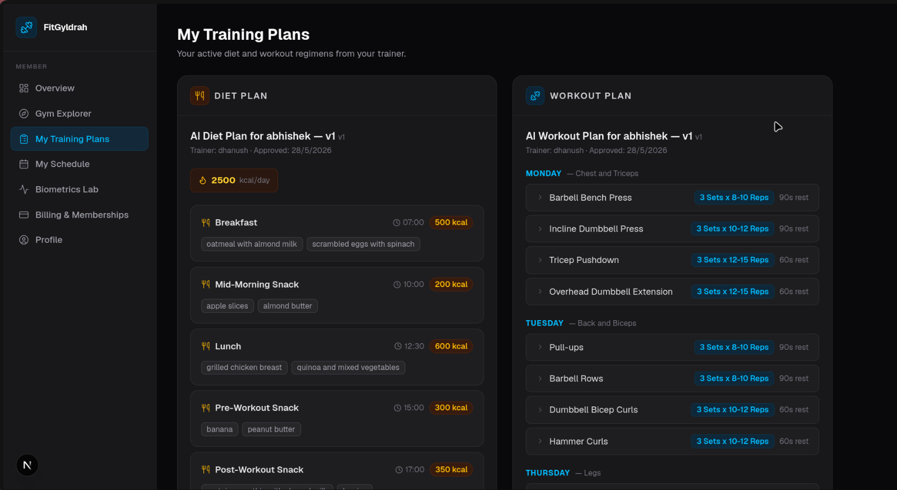

<div align="center">

# ⚔️ FitGyldrah

**A medieval-branded fitness SaaS platform that digitizes the relationship between Gym Owners, Trainers, and Members.**

<br/>


</div>

---

## What is FitGyldrah?

The fitness industry runs on fragmented tools — gym owners juggle spreadsheets, trainers text plans over WhatsApp, and members have no visibility into their own progress. **FitGyldrah** solves this by providing a single, unified platform for all three roles.

Wrapped in a medieval guild aesthetic (a "Gyldrah" is a guild of strength), the platform handles everything from gym registration and trainer onboarding to AI-generated fitness plans and automated payment splitting — all through a clean, role-aware interface.

**Key differentiators:**
- Asynchronous AI plan generation via **LangChain + Groq (Llama 3.3 70B)** — trainers trigger generation and poll for results; no blocking requests.
- **TimescaleDB hypertables** for member biometric time-series data with automatic partitioning and fast range queries.
- **Razorpay Route** marketplace model for automatic 95/5 revenue splitting between the platform and gym owners at the payment layer.
- Stateless **JWT authentication** with role-based access control enforced at the API permission layer.

---

## Core Architecture



The backend is a **Django monolith** decomposed into focused Django apps, each owning its own models, serializers, views, and URL routes. The frontend is a **decoupled Next.js application** (App Router) that communicates exclusively via the REST API.

```
Browser (Next.js)  ──REST──▶  Django API (DRF)  ──▶  PostgreSQL / TimescaleDB
                                     │
                                     ├──▶  Redis (Celery Broker)
                                     │         │
                                     │         └──▶  Celery Worker
                                     │                    │
                                     │                    └──▶  Groq API (Llama 3.3 70B)
                                     │
                                     └──▶  Razorpay Route API
```

| Layer | Technology | Role |
|---|---|---|
| Frontend | Next.js 16 (App Router), TypeScript, Tailwind CSS v4, `lucide-react` | UI, routing, API consumption |
| Backend API | Django 5.2, Django REST Framework | Business logic, REST endpoints |
| Database | PostgreSQL 15 + TimescaleDB extension | Relational data + biometric time-series |
| Task Queue | Celery 5.4 + Redis 7 | Async AI plan generation |
| AI Engine | LangChain + Groq API (Llama 3.3 70B) | Workout & diet plan generation |
| Payments | Razorpay Route (Marketplace) | Payment collection + automatic fee splitting |
| Auth | `djangorestframework-simplejwt` | Stateless JWT, token rotation & blacklisting |

---

## The Three User Roles

Every user claims a single role during onboarding. Role is enforced at the API permission layer — not just the UI.

| Role | Capabilities |
|---|---|
| **Owner** | Register and manage gyms · Define subscription tiers (monthly/yearly) · Connect a Razorpay bank account for payment routing · Review and approve/reject trainer applications · View gym-level enrollment and revenue data |
| **Trainer** | Apply to gyms with a CV and cover letter · Manage assigned members · Trigger AI-generated workout and diet plans · Review, edit, and approve AI-drafted plans before members can see them · Log and track member biometric readings · Schedule training sessions |
| **Member** | Browse and enroll in gyms by selecting a subscription tier · Complete checkout via Razorpay · View approved fitness plans assigned by their trainer · Log personal biometric readings (weight, body fat %, measurements) · Track progress over time via time-series biometric history |

---

## AI Automation Engine



Plan generation is fully asynchronous. A trainer triggers generation via a single API call; the heavy LLM work happens off the request thread in a Celery worker. The trainer polls for the result.

**Pipeline:**

```
Trainer API Request
      │
      ▼
Django View  ──▶  generate_fitness_plan_task.delay(trainer_id, member_id, plan_type)
                          │
                          ▼  (Celery Worker picks up from Redis)
                  1. Fetch trainer + member from DB
                  2. Create PENDING AIPromptLog
                  3. Build system + user prompt from member biodata (weight, height, BMI, goals)
                  4. Call Groq API via LangChain (Llama 3.3 70B, temp=0.4, max_tokens=4096)
                  5. Parse structured JSON response
                  6. Persist raw response + token counts to AIPromptLog
                  7. Create DRAFT FitnessPlan in DB
                  8. Mark log as SUCCESS, attach plan FK
                          │
                          ▼
              Trainer polls GET /api/ai/logs/{task_id}/
                          │
                          ▼
              Trainer reviews DRAFT plan → approves → Member can view
```

**Retry policy:** Groq API errors (`RuntimeError`) are retried up to 3 times with a 10-second backoff. Malformed JSON responses (`ValueError`) fail immediately without retry.

**Plan types:**
- `DIET` — structured daily meal plan with macros, calories, hydration, and meal timing.
- `WORKOUT` — weekly split programme (PPL / Upper-Lower / Full Body) with exercises, sets, reps, and rest periods.

Both plan types use strict JSON schema enforcement in the system prompt — the LLM is instructed to return only valid JSON with no markdown or preamble.

---

## Key Technical Decisions

### TimescaleDB for Biometric Time-Series

The `biometrics` table is converted to a **TimescaleDB hypertable** after the initial Django migration (see `biometrics/migrations/0002_create_hypertable.py`). TimescaleDB automatically partitions the table by `recorded_at`, enabling fast time-range queries (weekly trends, monthly averages) without manual partitioning logic. A composite index on `(user, recorded_at)` covers the most common query pattern.

### Razorpay Route for Split Payments

FitGyldrah uses the **Razorpay Route (Marketplace)** model. The platform collects the full membership fee via its master Razorpay account, then automatically routes **95% to the gym owner's linked account** and retains **5% as a platform fee**. The split amounts are stored in the `Transaction` model for audit purposes. A gym cannot accept payments until its owner completes bank onboarding and a `razorpay_linked_account_id` is set on the `Gym` record.

### Stateless JWT Authentication

Authentication uses `djangorestframework-simplejwt` with the following configuration:
- Access tokens expire after **30 minutes**.
- Refresh tokens expire after **7 days**.
- **Token rotation** is enabled — a new refresh token is issued on every refresh call.
- **Blacklisting** is enabled — rotated refresh tokens are immediately invalidated.
- All API endpoints default to `IsAuthenticated`. Role-specific endpoints use custom permission classes (`IsOwner`, `IsTrainer`, `IsMember`).

---

## Local Development Quick Start

### Prerequisites

- [Docker Desktop](https://www.docker.com/products/docker-desktop/) (or Docker Engine + Compose plugin)
- Git

### 1. Clone the repository

```bash
git clone <YOUR_REPO_URL>
cd FitGyldrah
```

### 2. Configure environment variables

Create a `.env` file in the project root. **Never commit this file.**

```env
# Django
SECRET_KEY=your-secure-secret-key-here
DEBUG=True
ALLOWED_HOSTS=localhost,127.0.0.1,0.0.0.0

# PostgreSQL
POSTGRES_DB=FitGyldrah
POSTGRES_USER=GyldrahUser
POSTGRES_PASSWORD=your_secure_password
DB_HOST=db
DB_PORT=5432

# Groq AI Engine — get your key at console.groq.com
GROQ_API_KEY=your_groq_api_key

# Redis (Celery broker — uses the Docker service name)
REDIS_URL=redis://redis:6379/0

# Razorpay — use test keys for local development
RAZORPAY_KEY_ID=rzp_test_xxxxxxxxxxxx
RAZORPAY_KEY_SECRET=your_razorpay_secret
```

### 3. Build and start all services

```bash
docker compose up --build
```

This starts five services defined in `docker-compose.yml`:

| Service | Container | Port |
|---|---|---|
| PostgreSQL 15 | `fitgyldrah_db` | `5439` (host) → `5432` (container) |
| Redis 7 | `fitgyldrah_redis` | `6379` |
| Django API | `fitgyldrah_backend` | `8000` |
| Celery Worker | `fitgyldrah_celery` | — |
| Next.js Frontend | `fitgyldrah_frontend` | `3000` |

### 4. Run database migrations

In a separate terminal, after the containers are healthy:

```bash
docker compose exec backend python manage.py migrate
```

### 5. Create a superuser (optional)

```bash
docker compose exec backend python manage.py createsuperuser
```

### 6. Access the application

| Service | URL |
|---|---|
| Frontend (Next.js) | http://localhost:3000 |
| Backend API (Django) | http://localhost:8000 |
| Django Admin | http://localhost:8000/admin |

### 7. Stop all services

```bash
docker compose down
```

To also remove the database volume:

```bash
docker compose down -v
```

---

## API Reference

All API endpoints are prefixed with `/api/`. Authentication uses `Bearer <access_token>` in the `Authorization` header.

| Prefix | App | Description |
|---|---|---|
| `/api/auth/` | `authentication` | Register, login, token refresh, logout |
| `/api/gyms/` | `gyms` | Gym CRUD, subscription tiers, bank onboarding |
| `/api/trainers/` | `trainers` | Trainer profiles, gym applications |
| `/api/members/` | `members` | Enrollments, member management |
| `/api/schedules/` | `schedules` | Session scheduling |
| `/api/plans/` | `plans` | Fitness plan CRUD, approval workflow |
| `/api/biometrics/` | `biometrics` | Biometric logging and time-series queries |
| `/api/ai/` | `ai_engine` | AI plan generation trigger, task polling, logs |
| `/api/payments/` | `payments` | Razorpay order creation, payment verification |

---

## Project Structure

```
FitGyldrah/
├── backend/                        # Django monolith
│   ├── backend/                    # Project settings, URLs, Celery config, WSGI/ASGI
│   │   ├── settings.py
│   │   ├── urls.py
│   │   ├── celery.py
│   │   └── wsgi.py
│   │
│   ├── authentication/             # Custom User model, JWT auth, RBAC permissions
│   ├── gyms/                       # Gym model, SubscriptionTier, Razorpay bank onboarding
│   ├── trainers/                   # TrainerProfile, GymApplication workflow
│   ├── members/                    # MemberEnrollment, subscription lifecycle
│   ├── schedules/                  # Training session scheduling
│   ├── plans/                      # FitnessPlan model, DRAFT → APPROVED workflow
│   ├── biometrics/                 # TimescaleDB hypertable, biometric time-series
│   ├── ai_engine/                  # Celery tasks, LangChain/Groq client, prompt builder, AIPromptLog
│   ├── payments/                   # Transaction model, Razorpay Route integration
│   ├── trainer_cvs/                # CV file uploads (media)
│   ├── trainer_pics/               # Profile picture uploads (media)
│   ├── manage.py
│   ├── requirements.txt
│   └── Dockerfile
│
├── frontend/                       # Next.js 16 (App Router)
│   ├── src/
│   │   ├── app/                    # App Router pages and layouts
│   │   ├── components/             # Shared UI components (lucide-react icons)
│   │   └── lib/                    # API client, utilities, type definitions
│   ├── public/                     # Static assets
│   ├── package.json
│   ├── tsconfig.json
│   ├── tailwind.config.ts
│   └── Dockerfile
│
├── assets/                         # Architecture diagrams and screenshots
├── .env                            # Root environment variables (git-ignored)
├── .gitignore
├── docker-compose.yml              # Orchestrates db, redis, backend, celery, frontend
└── README.md
```

---

## Git Workflow

- **Never push directly to `main`.** All changes go through a feature branch and pull request.
- Branch naming: `feature/<name>`, `fix/<name>`, `chore/<name>`

```bash
# Create a feature branch
git checkout -b feature/your-feature-name

# Stage and commit
git add .
git commit -m "feat: describe your change clearly"

# Push and open a PR
git push -u origin feature/your-feature-name
```

---

## License

This project is licensed under the [MIT License](LICENSE).
